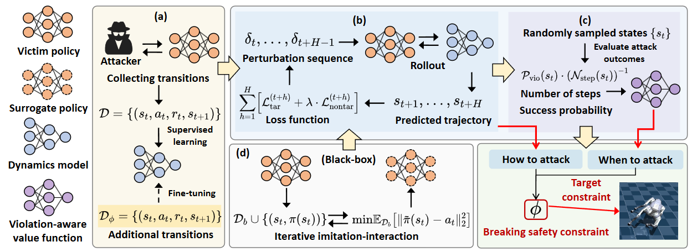
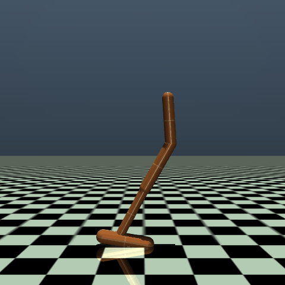
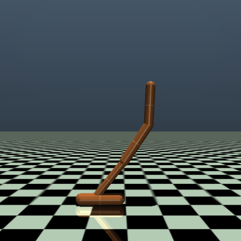
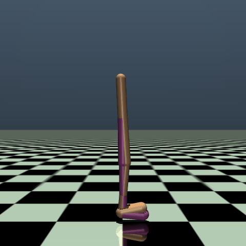
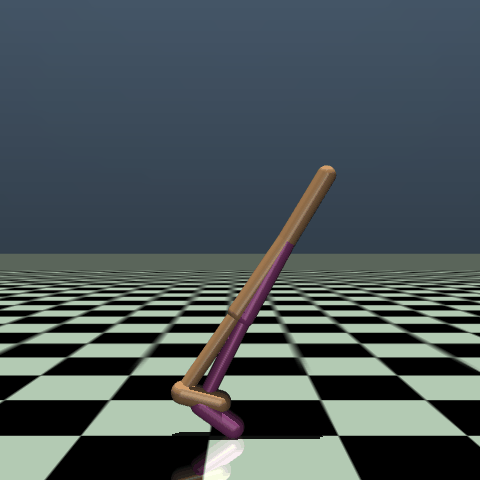
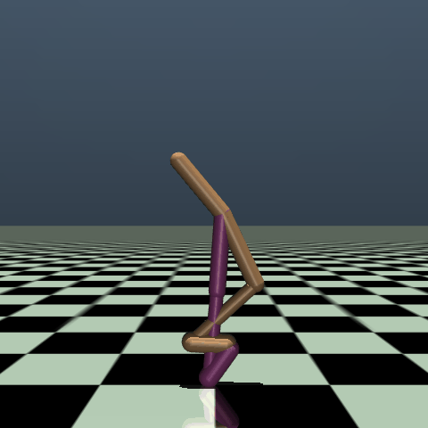
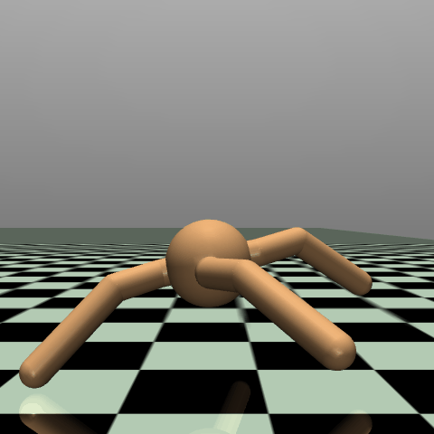
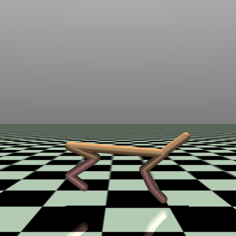

##  Model-Predictive Adversarial Attack for Breaking Safety Constraints in Deep Reinforcement Learning Agents

###  Overview

<div align="center">

  

</div>

MPA is a novel model-predictive adversarial attack specifically designed to break safety constraints, as illustrated in Figure 1, comprising four core components:

1. Dynamics model learning: MPA first collects diverse environment transitions through adversarial interactions to train a robust dynamics model, which is then fine-tuned for better prediction near safety boundaries.
2. Perturbation synthesis: Leveraging the learned dynamics model, MPA introduces a model-predictive perturbation synthesis module that simulates future trajectories under candidate perturbations and iteratively refines them using gradient-based optimization, aiming to steer the system toward targeted constraint violations. 
3. Attack timing selection: To reduce perturbation cost, MPA incorporates a violation-aware value function to guide attack timing, enabling more efficient and targeted interventions.

4. Black-box Adaptation: Under black-box settings, MPA incorporates a behavior cloning module that learns a surrogate policy to approximate the victim agent’s behavior, thereby enabling gradient-based optimization without requiring direct access to the victim policy’s gradients.

###  🚀 Installation

\- Python 3.7+

\- mujoco 2.3.3

\- torch 1.11.0+

###  🎯 Testing 

The command structure uses the following implementation script:

```bash
python main_MPA_black.py --env_id={ENVIRONMENT} --attack_flag={ATTACK_TYPE} --max_perturbation={MAGNITUDE} --Horizon={STEPS} --train_or_test=test
```

- `--env_id`: Specifies the Gym environment
- `--attack_flag`: Defines the targeted safety constraint
- `--max_perturbation`: Maximum perturbation magnitude
- `--Horizon`: Planning horizon
- `--train_or_test=test`: Runs evaluation in test mode

#### Evaluation under white-box Setting

To evaluate the attack performance of the MPA under the white-box setting, execute the following commands for different environments, attack types, and perturbation configurations:

##### Hopper-v3 Environment

```bash
# Safety constaint: angle of the torso > -0.2
python main_MPA_white.py --env_id=Hopper-v3 --attack_flag=a_low --max_perturbation=0.075 --horizon=2  --train_or_test=test

# Safety constaint: angle of the torso < 0.2
python main_MPA_white.py --env_id=Hopper-v3 --attack_flag=a_up --max_perturbation=0.075 --horizon=2  --train_or_test=test

# Safety constaint: z-coordinate of the torso > 0.7
python main_MPA_white.py --env_id=Hopper-v3 --attack_flag=z_low --max_perturbation=0.075 --horizon=2  --train_or_test=test
```

##### Walker2d-v3 Environment

```bash
# Safety constaint: angle of the torso > -1.0
python main_MPA_white.py --env_id=Walker2d-v3 --attack_flag=a_low --max_perturbation=0.15 --horizon=2  --train_or_test=test

# Safety constaint: angle of the torso < 1.0
python main_MPA_white.py --env_id=Walker2d-v3 --attack_flag=a_up --max_perturbation=0.15 --horizon=2  --train_or_test=test

# Safety constaint: z-coordinate of the torso > 0.8
python main_MPA_white.py --env_id=Walker2d-v3 --attack_flag=z_low --max_perturbation=0.15 --horizon=2  --train_or_test=test
```

##### HalfCheetah-v3 Environment

```bash
# Safety constaint: z-coordinate of the torso > -0.35
python main_MPA_white.py --env_id=HalfCheetah-v3 --attack_flag=z_low --max_perturbation=0.15 --horizon=2  --train_or_test=test
```

##### Ant-v3 Environment

```bash
# # Safety constaint: z-coordinate of the torso < 1.0
python main_MPA_white.py --env_id=Ant-v3 --attack_flag=z_up --max_perturbation=0.15 --horizon=2  --train_or_test=test
```

#### Evaluation under Black-box Setting

To evaluate the attack performance of MPA under the black-box setting, you can use a similar command structure with the `main_MPA_black.py` script. Here's how to execute it for different environments and attack configurations:

```bash
python main_MPA_black.py --env_id=Hopper-v3 --attack_flag=a_up --max_perturbation=0.075 --horizon=2  --train_or_test=test
```

#### Evaluated Metrics 

The following metrics are logged:

- Attack Success Rate
- Conditional Attack Steps
- Expected Attack Steps

###  🎯 Training

#### Training the Victim Agent

To train the victim agent, use the following command:

```bash
python train_victim_agent.py --env_id=Hopper-v3 --run=1
```

- `--env_id=Hopper-v3`: Specifies the Gym environment to train in (e.g., `Hopper-v3`, `Walker2d-v3`, etc.)
- `--run=1`: Designates the run identifier for experiment tracking

The trained model will be saved in the directory: ./runs/train_victim_agent/Hopper-v3_train_victim_agent_2025_1

#### Training and Fine-tuning the Dynamics Model

To train the dynamics model for a reinforcement learning environment, use the following command:

```bash
python train_dynamics_model.py --env_id=Walker2d-v3 --train_or_finetune=train --dataset_path="YOUR_DATA_PATH"
```

- `--train_or_finetune=train`: Indicates training from scratch
- `--dataset_path="YOUR_DATA_PATH"`: Path to the dataset for training (replace with your actual data path)

To fine-tune the dynamics model with adversarial perturbations, use:

```bash
python train_dynamics_model.py --env_id=Walker2d-v3 --attack_flag=a_low --max_perturbation=0.15 --train_or_finetune=finetune
```

#### Training the Violation-Aware Value Function

To train the Violation-Aware Value Function for adversarial robustness, use the following command:

```bash
python main_MPA_white.py --env_id=Hopper-v3 --attack_flag=a_up --max_perturbation=0.075 --horizon=2 --train_or_test=train-value
```

#### Training the Surrogate Agent

To train the surrogate agent for adversarial policy attack experiments, use the following command:

```bash
python train_surrogate_agent.py --env_id=Walker2d-v3 --attack_flag=a_low --max_perturbation=0.15
```

###  🎯 Effect of MPA

|  |  |  |  |
| ------------------------------------------------------------ | ------------------------------------------------------------ | ------------------------------------------------------------ | ------------------------------------------------------------ |
| Hopper-v3- $\phi_{\text{H1}}$                                | Hopper-v3- $\phi_{\text{H2}}$                                 | Hopper-v3- $\phi_{\text{H3}}$                                 | Walker2d-v3- $\phi_{\text{W1}}$                               |

|  |  |  |  |
| ------------------------------------------------------------ | ------------------------------------------------------------ | ------------------------------------------------------------ | ------------------------------------------------------------ |
| Walker2d-v3- $\phi_{\text{W2}}$                               | Walker2d-v3- $\phi_{\text{W3}}$                               | Ant-v3- $\phi_{\text{A}}$                                     | HalfCheetah-v3- $\phi_{\text{Hf}}$                            |

###  🎯 Acknowledgments

[cleanrl](https://github.com/vwxyzjn/cleanrl) for the implementation of victim agents


